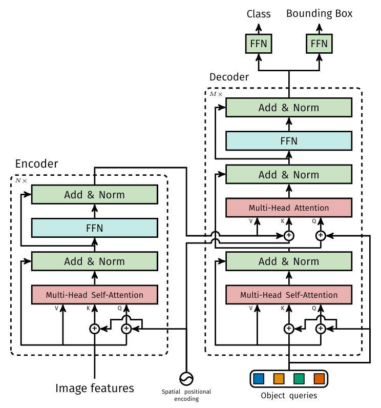

# DETR (DEtection TRansformer) project description

## Overview
This project implements a **DETR (DEtection TRansformer)** model using a **ResNet50** or a **DINOv2** backbone for object detection tasks on the COCO 2017 dataset. It leverages PyTorch Lightning for structured training process. Since the release of DETR more advanced models have been published with better overall performance, but this project aims directly the understanding of the core idea behind all.<br>
Note: The code is not optimized and the training converges slowly, which makes hard to use with limited resources.

## Project Structure
```
dino-detr-pl
├── doc
│   └── 
│   ├── detr_vs_vit.md       # Differences between DETR and ViT architectures
    └── End-to-End Object Detection with Transformers.pdf  # DETR paper
├── src
│   ├── callbacks.py         # Custom callbacks for monitoring training
│   ├── coco.py              # Data loading and preprocessing for the COCO dataset
│   ├── datamodule.py        # Data handling
│   ├── detr.py              # Implementation of the DETR model architecture
│   ├── detr_utils.py        # Utility functions (not required for training or inference)
|   ├── inference.py         # Running inference and visualize the predictions
│   ├── lightning_module.py  # PyTorch Lightning wrapper module for the model class
│   ├── matcher.py           # The Hungarian algorithm
│   ├── plot.py              # Visualization functions of model predictions (for inference)
│   └── train.py             # Training loop and logic
├── configs
│   └── default.yaml         # Configuration settings for the project
├── requirements.txt         # Project dependencies
├── pyproject.toml           # Project metadata and dependencies
└── README.md                # Project documentation
```

## Installation
To set up the project, clone the repository and install the required dependencies:

```bash
git clone <repository-url>
cd dino-detr-pl
pip install -r requirements.txt
```

## Usage
1. **Data preparation**: Ensure you have the COCO dataset downloaded and the paths set correctly in the config file (e.g. `configs/default.yaml`).

2. **Training the model**: You can train the model using the following command:

```bash
python src/train.py --config configs/default.yaml
```

3. **Running inference**: To run inference on an example image, execute:

```bash
python src/inference.py
```

## Configuration
The configuration file `configs/default.yaml` contains hyperparameters and paths that can be adjusted for training.

## Monitoring Training

Training logs are saved to:
```
lightning_logs/version_X/
```

View with TensorBoard:
```bash
tensorboard --logdir lightning_logs/
```

## The paper

The original method is presented in this paper:
[Open the PDF](doc/End-to-End Object Detection with Transformers.pdf)

For more information refer to FAIR's deepwiki: https://deepwiki.com/facebookresearch/detr/1-detr-overview

## How DETR detects objects

Key features of the original method.

- **Direct Set Prediction:** Instead of using the conventional two-stage process involving region proposal networks (RPNs) and subsequent object classification, DETR frames object detection as a direct set prediction problem. It considers all objects in the image as a set and aims to predict their classes and bounding boxes in one pass. Two ingredients are essential for direct set predictions in detection:
    - A **set prediction loss** that forces unique matching between predicted and ground truth boxes. It is done using the Hungarian algorithm. 
    - An **architecture** that predicts a set of objects and models their relation in a single pass.

- **Transformer Self-Attention:** The transformer's self-attention mechanism is applied to the object queries and the spatial features (known as keys and values) extracted from the input image. This self-attention mechanism allows DETR to learn complex relationships and dependencies between objects and their spatial locations.

- **Parallel Predictions:** Using the information gathered from the self-attention mechanism, DETR simultaneously predicts the class and location (bounding box) for each object query. This parallel prediction is a departure from traditional object detectors, which often rely on sequential processing.

## Model architecture

<br>

- **Backbone (encoder):** Processes the input image to extract high-level visual features. Originally it is a CNN (like ResNet), but foundation models (like DINOv2) can also be used. These features retain spatial information about the objects in the image and serve as the foundation for subsequent operations.
- **Positional Encoding:** Injects positional information into the model. Since Transformers do not inherently possess spatial understanding, DETR adds positional encodings to the output of the backbone encoder. These positional encodings inform the model about the spatial relationships between different parts of the image. The encodings are crucial for the Transformer to understand the absolute and relative positions of objects.
- **Transformer Encoder:** Captures global contextual information and spatial relationships (fine-tuning the features of the backbone encoder).
- **Transformer Decoder:** Attends to object features and generates bounding box predictions and class labels.
- **Object Queries, keys and values:** DETR introduces the concept of object queries, keys and values. Object queries are learnable representations of different objects in the image. The number of object queries is typically fixed, regardless of the number of objects in the image. Keys and values correspond to spatial features extracted from the backbone encoder's output. Keys represent the spatial locations in the image, while values contain feature information. These keys and values are used for self-attention, allowing the model to weigh the importance of different image regions.
- **Prediction Heads**: Each decoded embedding corresponds to one predicted object. They are passed to a class prediction head and a bounding box prediction head. The output is class probabilities and bounding box coordinates for each object.

## Transformer architecture


The heart of the DETR architecture lies in its use of **multi-head self-attention**. This mechanism allows DETR to capture complex relationships and dependencies between objects within the image. Each attention head can focus on different aspects and regions of the image simultaneously. Multi-head self-attention enables DETR to understand both local and global contexts, improving its object detection capabilities.

## Loss function
DETR finds an optimal one-to-one matching between predictions (model outputs) and ground-truth boxes using the Hungarian algorithm. Once the matching is fixed, the loss is computed on the matched pairs. The loss function consists of Cross Entropy for classification and L1 loss + GIoU loss for bounding box regression.

## Strengths of DETR

Below are some of the key strengths of the DETR architecture.

- End-to-End Object Detection: DETR offers an end-to-end solution for object detection, eliminating the need for separate region proposal networks and post-processing steps. This simplifies the overall architecture and streamlines the object detection pipeline.
- Parallel Processing: DETR predicts object classes and bounding boxes for all objects in an image simultaneously, thanks to the Transformer architecture. This parallel processing leads to faster inference times compared to sequential methods.
- Effective use of Self-Attention: the use of self-attention mechanisms in DETR enables it to capture complex relationships between objects and their spatial contexts. This results in improved object detection accuracy, especially in scenarios with crowded or overlapping objects.

## Disadvantages of DETR

Below are some of the disadvantages of the DETR architecture.

- High Computational Resources: training and using DETR can be computationally intensive, especially for large models and high-resolution images. This may limit its accessibility for researchers and practitioners without access to powerful hardware.
- Fixed Object Query Count: DETR requires specifying the number of object queries in advance, which can be a limitation when dealing with scenes containing varying numbers of objects. An incorrect number of queries may lead to missed detections or inefficiencies.
- The parallel processing is a great feature, but the overall training speed is slow, later model variations perform much better.
