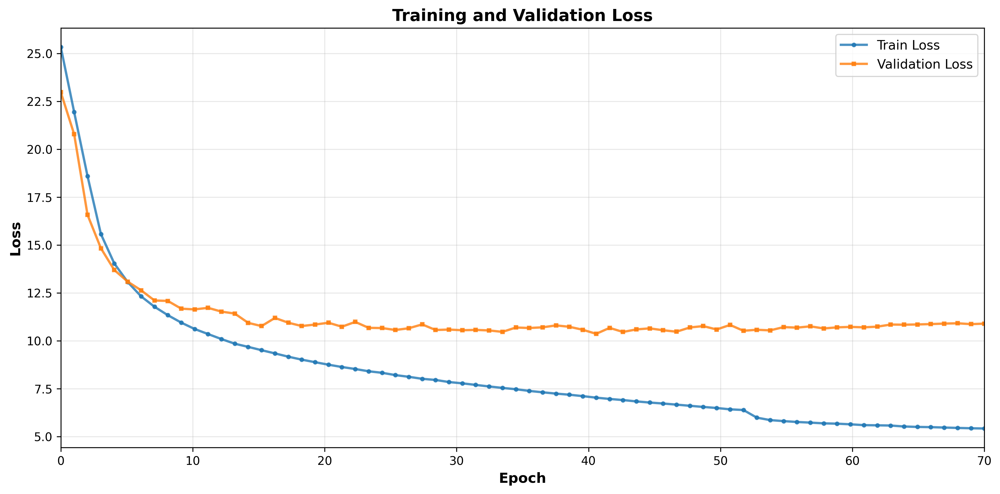
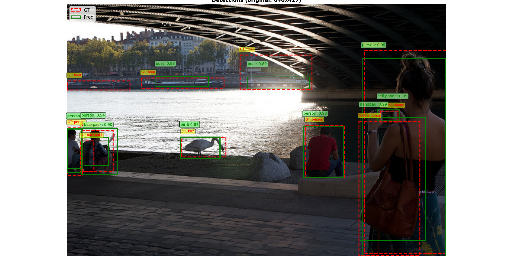
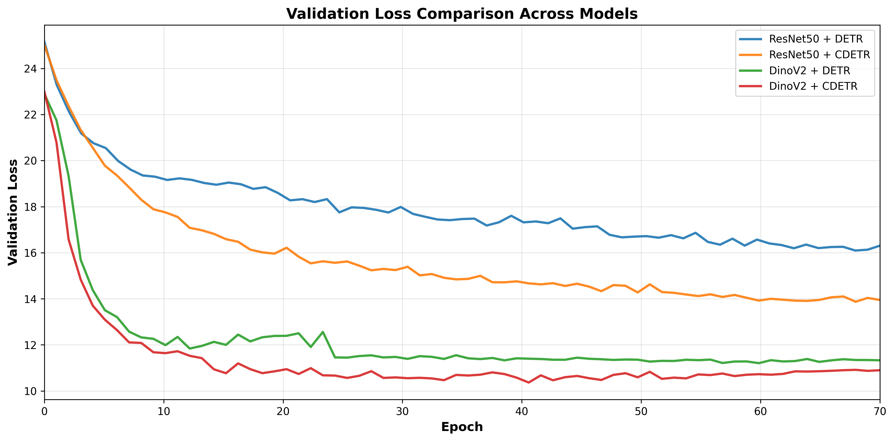
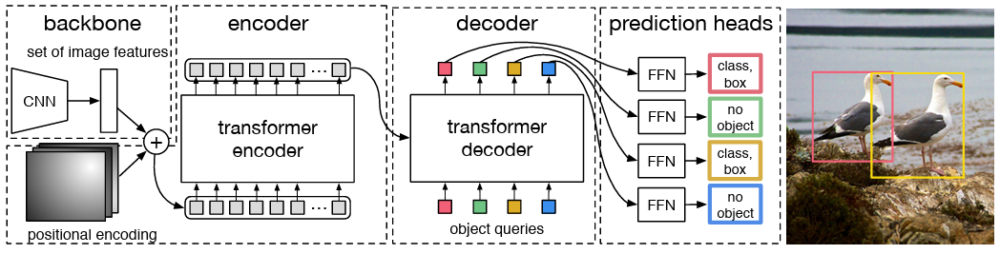
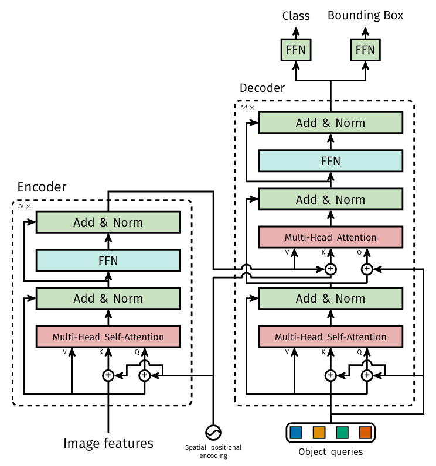

# DETR (DEtection TRansformer) project description

## Overview
This project contains the implementation of **DETR (DEtection TRansformer)** and **Conditional DETR** architectures (with the option to use either **DINOv2** or **ResNet** as backbone) for object detection task on the COCO 2017 dataset. It uses PyTorch Lightning for structured training and evaluation.

## Project Structure
```
dino-detr-pl
├── .vscode
│   └── launch.json               # VS Code debugger configuration
├── configs
│   └── default.yaml              # Configuration settings for the project
├── doc
│   ├── detr_vs_vit.md            # Differences between DETR and ViT architectures
│   └── DETR_paper.pdf            # The original DETR paper
├── src
│   ├── coco.py                   # Data loading and preprocessing for the COCO dataset
|   |── coco_eval_val2017.py      # COCO evaluator
│   ├── datamodule.py             # Data handling
│   ├── detr.py                   # Implementation of the DETR model architecture
│   ├── detr_utilis.py            # Utility functions (not required for training or inference)
|   ├── inference.py              # Running inference and visualize the predictions
│   ├── lightning_module.py       # PyTorch Lightning module for training and validation
│   ├── matcher.py                # The Hungarian algorithm.
│   ├── plot_losses.py            # Merge train and val TB losses into one plot
│   ├── plot.py                   # Visualization functions for model predictions (for inference)
│   ├── train.py                  # Training loop and logic
|   └── training_diagnostics.py   # Timing and memory diagnostics
├── requirements.txt         # Project dependencies
└── README.md                # Project documentation
```

## Installation
To set up the project, clone the repository and install the required dependencies:

```bash
git clone <repository-url>
cd DINO-DETR-Train
pip install -r requirements.txt
```

## Usage
1. **Data preparation**: Ensure you have the COCO dataset downloaded and the paths set correctly in the config file (e.g. `configs/default.yaml`).

2. **Training the model**: You can train the model using the following command:

```bash
python src/train.py --config configs/default.yaml
```

3. **Run local COCOeval on test dataset**:  To compute official-style COCO AP/AR metrics locally for your checkpoint, execute:

```bash
python src/coco_eval_val2017.py --config config_of_trained_model.yaml --checkpoint path_to_trained_model_checkpoint.ckpt --save-metrics outputs/cocoeval_val2017_metrics.json --save-predictions outputs/cocoeval_val2017_predictions.json"
```

This script evaluates on COCO val2017 with `pycocotools.COCOeval` and saves:
- detections JSON: `outputs/cocoeval_val2017_predictions.json`
- metric summary: `outputs/cocoeval_val2017_metrics.json`

4. **Inference and visualization**: To visualize the result with an example image, execute:

```bash
python src/inference.py
```

## Configuration
The configuration file [configs/default.yaml](./configs/default.yaml) contains hyperparameters and paths that can be adjusted for training and evaluation.

## Training Results

### Loss Curves
Below is a visualization of the combined training and validation loss curves for an example model training (Conditional DETR with DINOv2 backbone, 5000 validation images). The x-axis represents epochs, and the y-axis shows the loss values. This plot demonstrates the convergence behavior and the relationship between training and validation loss throughout the training process. It is clear that the best validation loss is in the 41th epoch, after it no real iprovement is noticed.


<br>

### Inference
The model (whose training curves are shown above) presents the following predictions capabilities on a sample image.


<br>

### Loss Comparison
The following figure compares validation loss across three model setups:
- Original DETR with ResNet-50 (OD-R50)
- Conditional DETR with ResNet-50 (CD-R50)
- Original DETR with DINOv2 (OD-DINO)
- Conditional DETR with DINOv2 (CD-DINO)


<br>

The training time of the models are not represented here, but on average one epoch for OD-R50 took 49 min, for CD-R50 took 51 min, for OD-DINO took 1h 40 minm and for CD-DINO took 2h 12 min. The faster convergence attribute of CD-Res50 over OD-Res50 is clear, and the significance of the huge DinoV2 backbone over ResNet50 is also obvious. The shape of OD-R50 and CD-R50 curves are convincing, but they need musch more apoch to reach the performance of the other two models. This is exactly what was reported in the original DETR paper. The shape of the OD-DINO and CD-DINO curves shows the faster convergence, but the performance stucks in both cases despite the decrease of the learning rate.

## Evaluation results

The COCO API (see [pycocotools](https://pypi.org/project/pycocotools/)) is a good choice if someone wants to evaluate a COCO-formatted dataset. I used the COCOEval class to do that on the full validation set (5000 images).

| Metric | IoU | ResNet50 + DETR | ResNet50 + CDETR | DinoV2 + DETR | DinoV2 + CDETR |
| --- | --- | --- | --- | --- | --- |
| AP | 0.50:0.95 | 0.045 | 0.132 | 0.281 | **0.317** 🥇 |
| AP50 | 0.50 | 0.108 | 0.267 | 0.470 | **0.525** 🥇 |
| AP75 | 0.75 | 0.033 | 0.116 | 0.287 | **0.327** 🥇 |
| AP_small | 0.50:0.95 | 0.009 | 0.019 | 0.070 | **0.092** 🥇 |
| AP_medium | 0.50:0.95 | 0.041 | 0.112 | 0.280 | **0.340** 🥇 |
| AP_large | 0.50:0.95 | 0.086 | 0.260 | 0.515 | **0.543** 🥇 |
| AR_max1 | 0.50:0.95 | 0.119 | 0.168 | 0.270 | **0.290** 🥇 |
| AR_max10 | 0.50:0.95 | 0.195 | 0.271 | 0.395 | **0.436** 🥇 |
| AR_max100 | 0.50:0.95 | 0.226 | 0.295 | 0.418 | **0.458** 🥇 |
| AR_small | 0.50:0.95 | 0.025 | 0.047 | 0.132 | **0.163** 🥇 |
| AR_medium | 0.50:0.95 | 0.194 | 0.287 | 0.459 | **0.516** 🥇 |
| AR_large | 0.50:0.95 | 0.453 | 0.577 | 0.711 | **0.737** 🥇 |


For all metrics the bigger value the better. In this 4-model comparison, DinoV2 + CDETR gives the strongest overall AP/AR results, which supports the initial assumption derived from the validation loss curves.

## How DETR Detects Objects

After introducing the repository content and the training/evaluation basics, let's take a few words about the background of DETR to see why was it exceptional at the time when it was presented.

The key features of the original method.

- **Direct Set Prediction:** Instead of using the conventional two-stage process involving region proposal networks (RPNs) and subsequent object classification, DETR frames object detection as a direct set prediction problem. It considers all objects in the image as a set and aims to predict their classes and bounding boxes in one pass. Two ingredients are essential for direct set predictions in detection:
    - A **set prediction loss** that forces unique matching between predicted and ground truth boxes. It is done using the Hungarian algorithm. 
    - An **architecture** that predicts a set of objects and models their relation in a single pass.

- **Transformer Self-Attention:** The transformer's self-attention mechanism is applied to the object queries and the spatial features (known as keys and values) extracted from the input image. This self-attention mechanism allows DETR to learn complex relationships and dependencies between objects and their spatial locations.

- **Parallel Predictions:** Using the information gathered from the self-attention mechanism, DETR simultaneously predicts the class and location (bounding box) for each object query. This parallel prediction is a departure from traditional object detectors, which often rely on sequential processing.

## Model architecture

<br>

- **Backbone (encoder):** Processes the input image to extract high-level visual features. Originally it is a CNN (like ResNet), but foundation models (like DINOv2) can also be used. These features retain spatial information about the objects in the image and serve as the foundation for subsequent operations.
- **Positional Encoding:** Injects positional information into the model. Since Transformers do not inherently possess spatial understanding, DETR adds positional encodings to the output of the backbone encoder. These positional encodings inform the model about the spatial relationships between different parts of the image. The encodings are crucial for the Transformer to understand the absolute and relative positions of objects.
- **Transformer Encoder:** Captures global contextual information and spatial relationships (fine-tuning the features of the backbone encoder).
- **Transformer Decoder:** Attends to object features and generates bounding box predictions and class labels.
- **Object Queries, keys and values:** DETR introduces the concept of object queries, keys and values. Object queries are learnable representations of different objects in the image. The number of object queries is typically fixed, regardless of the number of objects in the image. Keys and values correspond to spatial features extracted from the backbone encoder's output. Keys represent the spatial locations in the image, while values contain feature information. These keys and values are used for self-attention, allowing the model to weigh the importance of different image regions.
- **Prediction Heads**: Each decoded embedding corresponds to one predicted object. They are passed to a class prediction head and a bounding box prediction head. The output is class probabilities and bounding box coordinates for each object.

## Transformer architecture


The heart of the DETR architecture lies in its use of **multi-head self-attention**. This mechanism allows DETR to capture complex relationships and dependencies between objects within the image. Each attention head can focus on different aspects and regions of the image simultaneously. Multi-head self-attention enables DETR to understand both local and global contexts, improving its object detection capabilities.

To solve the notoriously slow training speed of the original model, **Conditional DETR** introduces a conditional cross-attention mechanism that dynamically links decoder queries to specific spatial locations. This simple spatial adaptation allows the model to converge up to 10x faster while maintaining highly accurate detection results.

## Loss function
DETR finds an optimal one-to-one matching between predictions (model outputs) and ground-truth boxes using the Hungarian algorithm. Once the matching is fixed, the loss is computed on the matched pairs. The loss function consists of Cross Entropy for classification and L1 loss + GIoU loss for bounding box regression.

## Strengths of DETR

Below are some of the key strengths of the DETR architecture.

- End-to-End Object Detection: DETR offers an end-to-end solution for object detection, eliminating the need for separate region proposal networks and post-processing steps. This simplifies the overall architecture and streamlines the object detection pipeline.
- Parallel Processing: DETR predicts object classes and bounding boxes for all objects in an image simultaneously, thanks to the Transformer architecture. This parallel processing leads to faster inference times compared to sequential methods.
- Effective use of Self-Attention: the use of self-attention mechanisms in DETR enables it to capture complex relationships between objects and their spatial contexts. This results in improved object detection accuracy, especially in scenarios with crowded or overlapping objects.

## Disadvantages of DETR

Below are some of the disadvantages of the DETR architecture.

- High Computational Resources: training and using DETR can be computationally intensive, especially for large models and high-resolution images. This may limit its accessibility for researchers and practitioners without access to powerful hardware.
- Very slow training convergence (but Conditional DETR speeds things up).
- Fixed Object Query Count: DETR requires specifying the number of object queries in advance, which can be a limitation when dealing with scenes containing varying numbers of objects. An incorrect number of queries may lead to missed detections or inefficiencies.

## Additional documentation

The original method is presented in this paper:
[Open the PDF](./doc/DETR_paper.pdf)

For more information refer to FAIR's deepwiki: https://deepwiki.com/facebookresearch/detr/1-detr-overview
